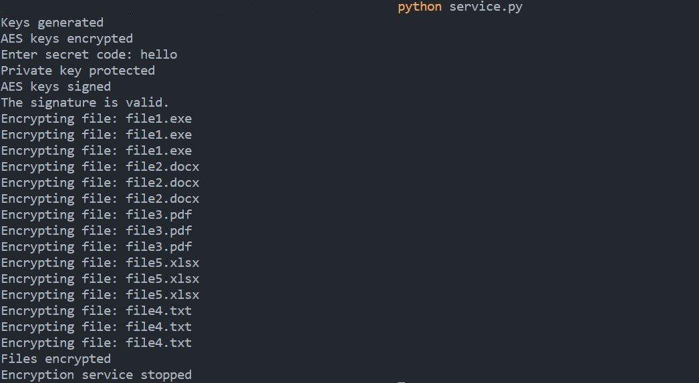

Directory Encryption
---
Directory Encryption is a simple python script that allows you to encrypt and decrypt directories using the 
Advanced Encryption Standard (AES) algorithm. 
It is designed to be easy to use and flexible, allowing you to encrypt multiple files in multiple directories fast.

## Requirements
Directory Encryption requires python3, PyYAML and the pycryptodome library to be installed on your system.
To install the requirements, run the following command: `pip install -r requirements.txt`

## How it works
Directory Encryption uses the AES algorithm with a 128-bit key to encrypt and decrypt directories. 
The password you provide is hashed using the MD5 algorithm and used as the key for the AES algorithm. 
This means that the password you provide is never stored in plain text, and the encryption process is secure.

## Configuration
You can configure the YAML file to your needs. Specify the path to one or more directories 
in which you want to encrypt the files as well as the file extensions you would like to act on.
The bit size for the AES algorithm can also be specified. The default is 128 bits. Other options are 192 and 256 bits.

## Usage
Once you have the requirements installed and have configured `config.yml`, run the script using `python service.py`
You will be prompted to enter a password to use for the encryption/decryption process.

The scripts/test_script.py file is used to test the encryption and decryption process. It is not necessary to run this file.
It will create multiple directories and files in the current working directory and encrypt them.

It is recommended to run the script on startup and/or shutdown to ensure that your files are always encrypted. This can
be set up using a cron job or a systemd service easily based on your operating system.

IMPORTANT: Make sure to understand how the script works and add decryption functionality to the startup/shutdown script.

## Example Usage

## Contributing
If you would like to contribute to Directory Encryption, please submit a pull request. We welcome bug fixes, feature requests, and other improvements.

## License
Directory Encryption is licensed under the MIT License. See LICENSE for more information.